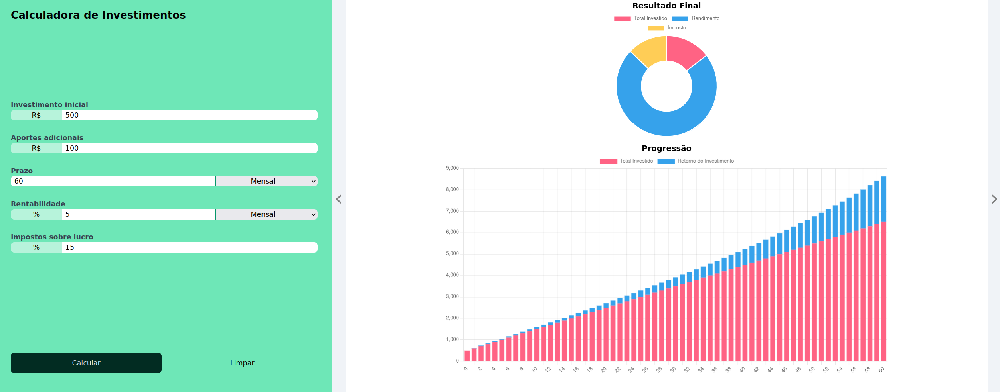

# Calculadora de Investimentos

Este é um projeto de calculadora de investimentos que possibilita visualizar a evolução do investimento ao longo do tempo, exibindo gráficos e uma tabela com resultados mensais.

## Funcionalidades

### 1. Formulário de Investimento

O formulário de investimento permite que você insira as seguintes informações:

- **Investimento Inicial**: Valor inicial investido.
- **Aportes Adicionais**: Montante extra investido periodicamente.
- **Prazo**: Período do investimento, podendo ser mensal ou anual.
- **Rentabilidade**: Taxa de retorno do investimento.
- **Impostos sobre Lucro**: Percentual de impostos sobre o lucro.

### 2. Gráficos

O projeto apresenta dois gráficos:

#### 2.1. Resultado Final

- **Gráfico de Rosca (Doughnut)**:
  - Mostra a distribuição do valor total investido, rendimento e impostos sobre o rendimento.

#### 2.2. Progressão

- **Gráfico de Barras (Bar)**:
  - Exibe a progressão do investimento ao longo do tempo, incluindo o total investido e o retorno do investimento.

### 3. Tabela de Resultados Mensais

Uma tabela apresenta os resultados mensais do investimento, incluindo informações como mês, total investido, rendimento mensal, rendimento total e quantia total.

### 4. Funcionalidade de Limpar

Um botão "Limpar" permite que você reinicie o formulário, limpando os dados inseridos, os gráficos e a tabela.

## Como Usar

1. Abra o arquivo `index.html` em um navegador web.
2. Preencha o formulário de investimento com as informações desejadas.
3. Clique no botão "Calcular" para visualizar os gráficos e a tabela com os resultados mensais.
4. Utilize o botão "Limpar" para reiniciar o formulário e limpar os resultados.

**Observação**: Certifique-se de preencher os campos corretamente para obter resultados precisos.

## Foto Projeto

## Deploy

https://calculadora.jcsalerno.com.br/

## Este projeto é apenas educativo e não oferece garantias quanto à precisão dos cálculos ou conselhos financeiros.
